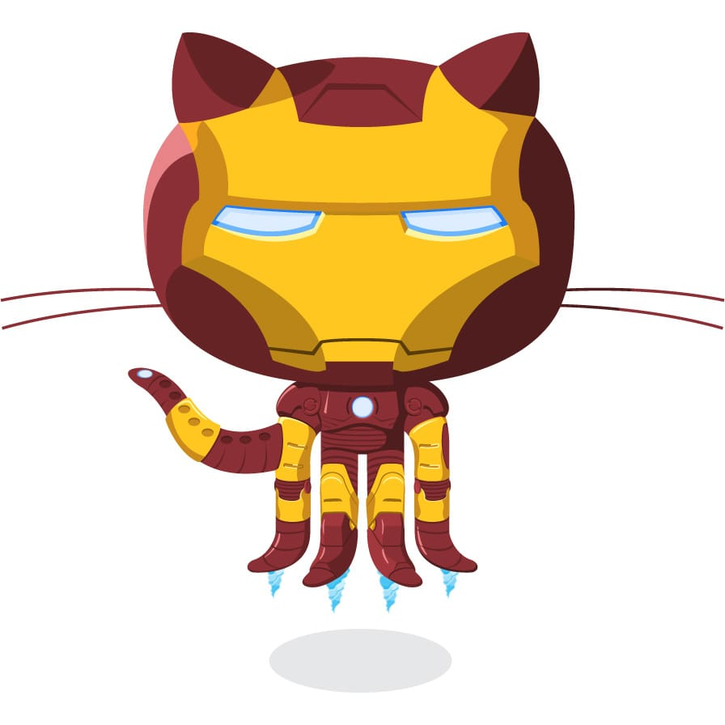

  

  

  
  &nbsp;
  

 

---

## 🧑‍💻 About Me

- 🌙 Night owl — most productive after sunset
- 💻 Mostly code in **JavaScript** & **TypeScript**
- 📍 Based in **Bangalore, India**
- 🔭 Currently building AI enabled full-stack apps
- 💼 Open to hire

 

---

## 🛠️ Languages

  &nbsp;&nbsp;
  &nbsp;&nbsp;
  &nbsp;&nbsp;
  &nbsp;&nbsp;
  

---

## 📦 Libraries & Frameworks

  &nbsp;&nbsp;
  &nbsp;&nbsp;
  &nbsp;&nbsp;
  &nbsp;&nbsp;
  &nbsp;&nbsp;
  &nbsp;&nbsp;
  &nbsp;&nbsp;
  &nbsp;&nbsp;

---

## 🔧 Tools & Platforms

  &nbsp;&nbsp;
  &nbsp;&nbsp;
  &nbsp;&nbsp;
  &nbsp;&nbsp;
  &nbsp;&nbsp;
  &nbsp;&nbsp;
  &nbsp;&nbsp;
  &nbsp;&nbsp;
  &nbsp;&nbsp;
  &nbsp;&nbsp;
  &nbsp;&nbsp;
  

## ⏱️ WakaTime Stats

<!--START_SECTION:waka-->

<!--END_SECTION:waka-->

---

  

  

