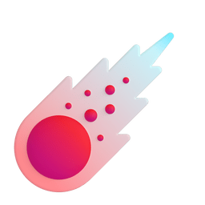

<p align="center">



</p>

<p align="center">
  
</p>

<div align="center">
  
  
  
</div>
  &nbsp;
  &nbsp;


<p align="center">
  <a href="mailto:hitesh.k.83080@gmail.com">
    
  </a>
  &nbsp;
  <a href="https://devhiteshk.netlify.app" target="_blank">
    
  </a>
</p>

<br/>

---

## 🧑‍💻 About Me

Software Development Engineer at **Omind.ai** with **2.4 years** of experience building production-grade full-stack applications. I specialize in **AI-powered tools** — from intelligent Git analytics to conversational chatbots that actually work. Passionate about bridging the gap between LLMs and real-world products.

- 💼 SDE @ **Omind.ai**
- 🤖 Building AI tools — Git Stats & Chatbots
- 💻 Mostly code in **JavaScript** & **TypeScript**
- 🌙 Night owl — most productive after sunset
- 📍 Based in **Bangalore, India**
- � Open to hire

---

## 🛠️ Languages

<p align="left">
  &nbsp;
  &nbsp;
  &nbsp;
  &nbsp;
  
</p>

---

## 🤖 AI & LLM

<p align="left">
  &nbsp;
  &nbsp;
  &nbsp;
  &nbsp;
  
</p>

---

## 📦 Libraries & Frameworks

<p align="left">
  &nbsp;
  &nbsp;
  &nbsp;
  &nbsp;
  &nbsp;
  &nbsp;
  &nbsp;
  
</p>

---

## 🔧 Tools & Platforms

<p align="left">
  &nbsp;
  &nbsp;
  &nbsp;
  &nbsp;
  &nbsp;
  &nbsp;
  &nbsp;
  &nbsp;
  &nbsp;
  &nbsp;
  &nbsp;
  &nbsp;
  &nbsp;
  &nbsp;
  
</p>


## ⏱️ WakaTime Stats

<!--START_SECTION:waka-->


**🐱 My GitHub Data** 

> 📦 468.6 kB Used in GitHub's Storage 
 > 
> 🏆 23 Contributions in the Year 2026
 > 
> 💼 Opted to Hire
 > 
> 📜 101 Public Repositories 
 > 
> 🔑 13 Private Repositories 
 > 
**I'm a Night 🦉** 

```text
🌞 Morning                172 commits         ███░░░░░░░░░░░░░░░░░░░░░░   10.64 % 
🌆 Daytime                369 commits         ██████░░░░░░░░░░░░░░░░░░░   22.82 % 
🌃 Evening                1022 commits        ████████████████░░░░░░░░░   63.20 % 
🌙 Night                  54 commits          █░░░░░░░░░░░░░░░░░░░░░░░░   03.34 % 
```
📅 **I'm Most Productive on Tuesday** 

```text
Monday                   231 commits         ████░░░░░░░░░░░░░░░░░░░░░   14.29 % 
Tuesday                  314 commits         █████░░░░░░░░░░░░░░░░░░░░   19.42 % 
Wednesday                233 commits         ████░░░░░░░░░░░░░░░░░░░░░   14.41 % 
Thursday                 174 commits         ███░░░░░░░░░░░░░░░░░░░░░░   10.76 % 
Friday                   203 commits         ███░░░░░░░░░░░░░░░░░░░░░░   12.55 % 
Saturday                 219 commits         ███░░░░░░░░░░░░░░░░░░░░░░   13.54 % 
Sunday                   243 commits         ████░░░░░░░░░░░░░░░░░░░░░   15.03 % 
```


📊 **This Week I Spent My Time On** 

```text
🕑︎ Time Zone: Asia/Kolkata

💬 Programming Languages: 
Bash                     18 mins             █████████████░░░░░░░░░░░░   50.24 % 
JavaScript               18 mins             ████████████░░░░░░░░░░░░░   49.51 % 
Other                    0 secs              ░░░░░░░░░░░░░░░░░░░░░░░░░   00.14 % 
JSON                     0 secs              ░░░░░░░░░░░░░░░░░░░░░░░░░   00.12 % 

🔥 Editors: 
Kiro                     37 mins             █████████████████████████   100.00 % 

🐱‍💻 Projects: 
Gitstats-MERN            36 mins             █████████████████████████   98.51 % 
notes-be                 0 secs              ░░░░░░░░░░░░░░░░░░░░░░░░░   01.49 % 

💻 Operating System: 
Mac                      37 mins             █████████████████████████   100.00 % 
```

**I Mostly Code in JavaScript** 

```text
JavaScript               22 repos            █████████░░░░░░░░░░░░░░░░   35.48 % 
TypeScript               14 repos            ██████░░░░░░░░░░░░░░░░░░░   22.58 % 
CSS                      5 repos             ██░░░░░░░░░░░░░░░░░░░░░░░   08.06 % 
Jupyter Notebook         3 repos             █░░░░░░░░░░░░░░░░░░░░░░░░   04.84 % 
MDX                      1 repo              ░░░░░░░░░░░░░░░░░░░░░░░░░   01.61 % 
```


 Last Updated on 16/05/2026 15:34:31 UTC
<!--END_SECTION:waka-->

---

<p align="center">
  
</p>

<p align="center">
  
</p>
